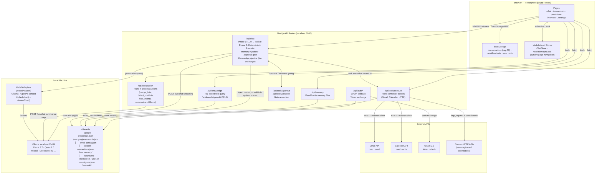

# Hearth — System Design

## v1 Goal

Hearth v1 = a local AI OS where the user can: connect core tools + run workflows + controlled execution + clearly see what AI is doing.

**v1 Success Criteria:**
1. Open app
2. Say one thing
3. Click one connect
4. Watch execution
5. Get result

---

## Architecture Diagram



---

## Three-Layer Architecture

```
🖥️  UI LAYER
    /chat · /connectors · /workflows · /memory · /settings
    Input · Execution Timeline · Connector setup · Workflow management

        ↓ user input / ↑ stream result

🧠  BUTLER LAYER  — Unified Brain
    Intent → LLM (plan only) → Task IR → Validator → Executor
    Single decision point: planning, validation, policy enforcement
    Reads from Knowledge Wiki (does not own it)

        ↓ call connector / ↑ data

🔧  CONNECTOR LAYER  — Tools & Data Sources
    Gmail · Calendar · Email · Memory · HTTP · System
    No personality, no dialogue — called only by Executor

        ↓ post-execution signals / ↑ wiki pages

🧠  KNOWLEDGE LAYER  — User Model
    Observation Extractor → Signal Store → Aggregator → Policy Engine → Wiki
    Independent of butler. Butler reads; butler does not write.
```

---

## Core: Task IR

Task IR (Intermediate Representation) is the system's central constraint layer. **The LLM only generates Task IR — it executes nothing.** The Executor validates the Task IR, then executes deterministically.

This is the only hard constraint preventing the system from degrading into a fuzzy agent.

### Task Schema

```typescript
type Task = {
  id: string
  type: "tool" | "action"      // tool = external API, action = local compute
  tool: string                  // connector name, e.g. "gmail" | "system"
  action: string                // action name, e.g. "get_inbox" | "merge_lists"
  args: Record<string, any>
  depends_on?: string[]         // task ids that must complete first
  safety_level: "low" | "medium" | "high"
  retry_policy?: "none" | "simple"
}

type TaskPlan = {
  tasks: Task[]
  trigger: "user_prompt" | "schedule" | "connector_event"
}
```

### Three Key Fields

| Field | Problem it solves |
|---|---|
| `safety_level` | Approval gate no longer hardcodes toolName — driven uniformly by this field |
| `depends_on` | Executor auto-sorts; LLM generation order doesn't matter |
| `type` | Executor routes: `tool` → `/api/tools/execute`, `action` → `/api/tools/action` |

### Validator Rules

1. All `args` must conform to the connector action's `input_schema`
2. `depends_on` task IDs must exist within the same plan
3. Dependency graph must be acyclic
4. `tool` + `action` combination must exist in the registered connector registry
5. Invalid → reject entire plan, return error to user

### Safety Level → Approval Gate

```
high   → must get user confirm  (send_email, http POST/DELETE)
medium → show to user, auto-execute  (calendar write)
low    → silent execution  (get_inbox, memory read, summarize)
```

---

## Butler Pipeline

### ReAct Loop

Replaced the original single-shot planning architecture with a ReAct (Reason + Act) loop. Each iteration the LLM decides one next action based on what it has seen so far, rather than generating a complete plan upfront.

**Why:** The old architecture required hardcoded rules for every proactive behavior ("before booking travel, check calendar"). With ReAct the model's own domain knowledge drives what to fetch — no enumeration needed.

```
User input
  → load memory (hearth.md + user.txt + top-5 semantic from memory.txt + goal wiki pages)
  → ReAct loop (max 5 iterations):
      → reactStep(messages, accumulated, adapter, model)
          → LLM reasons and outputs ONE next action, or action:null if done
          → hard dedup guard: same tool.action cannot repeat in one session
      → if action:null: break
      → validatePlan(singleTask)    — schema + registry check; break on failure
      → resolveCapabilities()       — resolve unknown targets
      → executePlan(singleTask, ctx):
          → enforcePolicy(safety_level)
          → if high: emit pending_approval, wait for user
          → enforceSecurityPolicy() — hard gate (unchanged):
              → capability check, path traversal, artifact injection,
                memory injection, outbound injection, unicode sanitization
          → if blocked: emit blocked step, skip
          → execute: type=tool → /api/tools/execute
                     type=action → /api/tools/action
          → emit execution_step to UI
      → accumulate {thought, task, result}
  → emit tool_history (alternating assistant reasoning + tool result messages)
  → [fire-and-forget] Knowledge pipeline (see below)
  → [synchronous] rankWikiPages() → inject <user_preferences> into synthesis prompt
  → streamFinal()
  → flushMemoryQueue()
```

**Proactive habits baked into reactStep prompt (butler behavior, not hardcoded rules):**
```
Time-sensitive request (travel, booking, appointment) → check calendar.get_events first
Named person (email to X, schedule with X)           → search memory for person context first
Email reply / follow-up                              → fetch inbox thread first
Purchase / subscription                              → search memory for spending preferences first
Recommendation (tool, product, service)              → search memory for user preferences first
```

**Knowledge pipeline (fire-and-forget, does not block synthesis):**
```
Runs after EVERY turn — tool-using AND pure conversation alike.
taskResults passed as tool.action-keyed map (e.g. "gmail.get_inbox", "plaid.get_transactions")

extractObservations(messages, namedResults) → PreferenceSignal[]
  → reads user messages
  → reads email sender lines (key matches /gmail|inbox|email/i — never full bodies)
  → reads financial data lines (key matches /expense|transaction|spend|finance|plaid/i)
      only: name / merchant / category / amount / price / platform fields
      never: account numbers, card numbers, routing numbers
  → appendSignal() each signal to ~/.hearth/memory/signals.jsonl (encrypted)
  → if signals extracted:
      → aggregateSignals(readSignalsSince(90d))
          → group by primary tag
          → threshold: frequency=1 → always passes
                       frequency>1 → frequency ≥ 1 AND span ≥ 24h
          → compute confidence = frequency / (frequency + 2)
      → for each cluster above threshold:
          → evaluateCluster() → write / merge / ignore
          → if not ignore: synthesizeCluster() via LLM (15s timeout)
          → executeDecision() → scanWikiContent() → writeWikiPage()
```

**Result: LLM reasons step by step. Each individual action is still deterministically validated and executed.**

---

## Connector Layer

### Connector Schema

```typescript
type ConnectorAction = {
  name: string
  input_schema: Record<string, any>   // used by Validator
  output_schema: Record<string, any>  // used by downstream tasks
  safety_level: "low" | "medium" | "high"
}

type Connector = {
  name: string
  auth: "oauth" | "api_key" | "none"
  allowed_domains?: string[]          // HTTP allowlist
  actions: ConnectorAction[]
}
```

### v1 Connectors

```
connectors = [
  {
    name: "gmail",
    auth: "oauth",
    allowed_domains: ["gmail.googleapis.com"],
    actions: [
      { name: "get_inbox",   safety_level: "low",  ... },
      { name: "send_email",  safety_level: "high", ... }
    ]
  },
  {
    name: "calendar",
    auth: "oauth",
    allowed_domains: ["www.googleapis.com"],
    actions: [
      { name: "get_events",    safety_level: "low",    ... },
      { name: "create_event",  safety_level: "medium", ... }
    ]
  },
  {
    name: "email",
    auth: "api_key",
    actions: [
      { name: "get_inbox",   safety_level: "low",  ... },
      { name: "send_email",  safety_level: "high", ... }
    ]
  },
  {
    name: "memory",
    auth: "none",
    actions: [
      { name: "add",    safety_level: "low", ... },
      { name: "search", safety_level: "low", ... },
      { name: "remove", safety_level: "low", ... }
    ]
  },
  {
    name: "http",
    auth: "api_key",
    actions: [
      { name: "get",    safety_level: "low",  ... },
      { name: "post",   safety_level: "high", ... },
      { name: "delete", safety_level: "high", ... }
    ]
  },
  {
    name: "system",   // local compute, in-process
    auth: "none",
    actions: [
      { name: "merge_lists",      safety_level: "low", ... },
      { name: "detect_conflicts", safety_level: "low", ... },
      { name: "filter_events",    safety_level: "low", ... },
      { name: "summarize",        safety_level: "low", ... }
    ]
  }
]
```

---

## Knowledge Memory System

The knowledge layer runs independently of the butler. Butler reads from it; it is populated by a separate pipeline that runs after execution. The LLM never writes directly to knowledge — it only supplies raw signals that a deterministic aggregator evaluates against a policy.

### Three-Layer Memory Model

```
┌─────────────────────┬────────────────────────────────────────────────────────┐
│ Runtime State       │ TaskPlan, ExecutionStep, taskResults — owned by        │
│                     │ plan-executor; discarded after response                │
├─────────────────────┼────────────────────────────────────────────────────────┤
│ Session Memory      │ tool_history hidden messages in localStorage —         │
│                     │ compressed context across turns; pruned to last 10     │
├─────────────────────┼────────────────────────────────────────────────────────┤
│ Knowledge Memory    │ ~/.hearth/memory/wiki/*.md — markdown wiki pages;      │
│                     │ user-editable; queried by tag before each synthesis    │
└─────────────────────┴────────────────────────────────────────────────────────┘
```

### Signal Taxonomy

```
preference   — communication style, format choices, tool preferences
fact         — objective facts (job, location, name)
pattern      — recurring behavior across sessions;
               also: spending habits extracted from financial tool results
               (domain: spending, metadata: { platform, category })
relationship — person the user interacts with (domain: people)
               metadata: { person, sentiment }
concern      — worry or stress (domain: wellbeing)
identity     — value or self-perception (domain: values)
learning     — topic being studied (domain: learning)
goal         — explicit target (domain: goals, metadata: { declared: true })
progress     — completion event or milestone (domain: progress)
```

### Signal → Wiki Pipeline

```
Post-execution (fire-and-forget)
  │
  ├─ [1] Observation Extractor (observation-extractor.ts)
  │       LLM call (15s timeout, fails to [])
  │       Input:  user messages
  │               + email sender lines (key /gmail|inbox|email/i — never full bodies)
  │               + financial data lines (key /expense|transaction|spend|finance|plaid/i)
  │                   only: name / merchant / category / amount / price / platform
  │                   never: account numbers, card numbers, routing numbers
  │       Tool results keyed by "tool.action" (e.g. "gmail.get_inbox")
  │       Output: PreferenceSignal[] — {type, domain, value, tags[], sessionId, metadata?}
  │       Rule:   only explicit or strongly implied signals extracted
  │
  ├─ [2] Signal Store (signal-store.ts)
  │       ~/.hearth/memory/signals.jsonl — per-line encrypted (encryptLine)
  │       Lazy prune: >500 lines → drop signals older than 90 days
  │
  ├─ [3] Memory Aggregator (memory-aggregator.ts)  ← deterministic, no LLM
  │       Relationship signals: group by metadata.person first → entity cluster per person
  │       All others: group by primary tag (tags[0] ?? domain)
  │       Write threshold:
  │         frequency = 1  → always passes (confidence 0.33 — unique fact, low confidence)
  │         frequency > 1  → frequency ≥ 1 AND span ≥ 24h
  │       Confidence: frequency / (frequency + 2)
  │         1 signal → 0.33  |  3 signals → 0.60  |  8 signals → 0.80
  │       Computes: week_counts (ISO week → count), trajectory (improving/declining/stable)
  │       Output: KnowledgeCluster[] sorted by confidence desc
  │
  ├─ [4] Memory Policy Engine (memory-policy.ts)
  │       evaluateCluster():
  │         person entity  → match by entity_type=person + personName → MERGE or WRITE
  │         goal entity    → match by entity_type=goal + tag          → MERGE or WRITE
  │         other          → match by primary tag                     → MERGE or WRITE
  │         confidence < 0.1 → IGNORE
  │       synthesizeCluster() — LLM uses entity-type-specific prompt (15s timeout)
  │       scanWikiContent() — injection pattern check before any write
  │       executeDecision() → writeWikiPage() → rebuildIndex()
  │
  └─ [5] Wiki (wiki.ts)
          ~/.hearth/memory/wiki/<slug>.md — plain UTF-8, mode 0600
          ~/.hearth/memory/wiki/index.md  — human-readable directory
          Atomic writes: .tmp + rename
          Queries: rankWikiPages(query, pages, ollamaUrl, model, topK)
                   queryWikiByEntityType(type), queryWikiAll(), listWikiPages()
          Person pages: person-<name>.md  |  Goal pages: goal-<slug>.md
```

### Weekly Digest Pipeline

```
Trigger: scheduled workflow (cron 0 21 * * 0) → system.generate_digest task
  │
  ├─ [1] readSignalsSince(7d)     — raw signal counts for the week
  ├─ [2] queryWikiAll()           — all wiki pages (people, goals, concerns, topics)
  ├─ [3] LLM synthesis (30s timeout)
  │       Relationship section:   people with activity this week + trend
  │       Noticing section:       concern/identity themes
  │       Progress section:       goals with new evidence
  │       Suggestion:             one actionable observation
  ├─ [4] writePendingDigest()     → ~/.hearth/memory/digest-pending.md (plain UTF-8)
  │
  └─ [5] App load → GET /api/knowledge/digest/pending
          → inject as read-only assistant message in chat UI
          → DELETE /api/knowledge/digest/pending when dismissed
```

### Wiki Page Format

Preference page:
```markdown
---
id: communication-style
title: Communication Style
tags: [communication, format]
confidence: 0.92
frequency: 6
last_updated: 2026-04-25
source: inferred
---

Prefers concise bullet-point lists over prose. Consistently observed
across email, summary, and document tasks.

## Evidence
- 2026-04-20: "make it short" (email)
- 2026-04-22: "bullet points please" (summary)
- 2026-04-24: "keep it brief" (calendar)
```

Person entity page:
```markdown
---
id: person-alice-chen
title: Alice Chen
tags: [person-alice-chen, people]
confidence: 0.75
frequency: 5
last_updated: 2026-04-25
source: inferred
entity_type: person
trajectory: improving
week_counts: {"2026-W16":2,"2026-W17":5}
---

Likely a colleague. Frequent email contact this week around project deadlines.
Interaction tone has been positive; topics cluster around scheduling and deliverables.

## Evidence
- 2026-04-23: "need to email Alice about the deadline" (people)
- 2026-04-24: "Alice from: deadline reminder" (people)
```

Goal page:
```markdown
---
id: goal-learn-rust
title: Learn Rust
tags: [goal-learn-rust, goals, learning]
confidence: 0.60
frequency: 4
last_updated: 2026-04-25
source: inferred
entity_type: goal
trajectory: stable
---

Working toward Rust proficiency. Progress is steady; currently focused on ownership and borrowing concepts.

## Evidence
- 2026-04-20: "I'm learning Rust" (goals)
- 2026-04-22: "trying to understand lifetimes" (learning)
```

### Key Invariants

| Invariant | Enforcement |
|---|---|
| LLM never writes to wiki directly | Only `executeDecision()` calls `writeWikiPage()` |
| Frequency is computed, not interpreted | `aggregateSignals()` is pure deterministic logic |
| No write without security scan | `scanWikiContent()` runs before every `writeWikiPage()` |
| Wiki files remain user-editable | Plain UTF-8, no encryption — same format as hearth.md |
| Butler reads wiki, does not own it | `rankWikiPages/queryWikiByEntityType` in `chat/route.ts`; all writes go through policy |
| Confidence score is bounded and formulaic | `freq / (freq + 2)` — no LLM-assigned confidence |
| Financial data never fully persisted | Extractor takes only name/merchant/category/amount/price/platform lines; account and card numbers excluded |
| Goal pages always injected | `queryWikiByEntityType('goal')` loaded into every system prompt |
| Knowledge pipeline runs every turn | Fires after both tool-using turns AND pure conversation turns |

### Wiki Retrieval at Synthesis Time

```
lastUserMsg (string, ≤500 chars)
  → rankWikiPages(query, nonGoalPages, ollamaUrl, model, topK=5)
      → embed query via Ollama (5s timeout)
      → for each page: embed title + tags + body[:200]
      → score = relevance×0.6 + (freq/maxFreq)×0.25 + exp(-daysSince/30)×0.15
      → if Ollama unavailable: relevance=0 → degrades to frequency+recency ranking
      → return top-5 pages
  → inject <user_preferences> block into synthesis prompt
      format: [Page Title] (confidence: 0.92)\n<body>
  → goal pages excluded (already in <user_goals> — no double injection)
```

### API Routes (butler reads via these; does not own wiki)

```
GET  /api/knowledge?tags=email,communication    → { pages: WikiPage[] }
GET  /api/knowledge/wiki                        → { pages: WikiPage[] }
POST /api/knowledge/wiki                        → create manual page
GET  /api/knowledge/wiki/[slug]                 → single page
PUT  /api/knowledge/wiki/[slug]  {raw: string}  → user edit (validates frontmatter, 400 on bad parse)
DEL  /api/knowledge/wiki/[slug]                 → delete + rebuild index
```

---

## Workflow

Workflows are stored directly as Task IR and share the same executor as chat. No two separate systems.

```typescript
type Workflow = {
  id: string
  name: string                    // e.g. "Morning Routine"
  trigger: TaskPlan["trigger"]
  tasks: Task[]                   // directly Task IR
  createdAt: string
  runs: WorkflowRun[]
}
```

**Benefits:**
- Workflow and chat run through the same executor
- Workflows automatically get the approval gate (`safety_level`)
- Workflows can be generated directly from chat (AI generates TaskPlan → saved to WorkflowStore)
- Dependencies expressed via `depends_on`, more reliable than array order

---

## Trigger Model

Three triggers defined upfront — otherwise morning automation will require a full rewrite:

```
user_prompt      → user types in /chat
schedule         → cron expression, fires workflow on schedule
connector_event  → reserved for future use (e.g. new email arrives triggers workflow)
```

v1 implements: `user_prompt` + `schedule`. `connector_event` interface reserved.

---

## Context Management

### Memory Tiers

```
┌────────────────┬──────────────────────────────────────────────────────────────┐
│ Within turn    │ task context (server RAM only, discarded after response)     │
│ Within session │ hidden messages in localStorage (pruned to last 10)          │
│ 7-day window   │ stale conversation hidden messages stripped on load/save     │
│ Cross-session  │ memory.txt / user.txt — distilled facts, not raw output      │
│ Long-term      │ wiki/*.md — inferred preferences, user-visible and editable  │
└────────────────┴──────────────────────────────────────────────────────────────┘
```

### Tool History (within-session continuity)

After each task executes, the server emits an `execution_step` event; the client stores it as a `hidden: true` message:

```
convo.messages = [
  { role: 'user',      hidden: false }
  { role: 'assistant', hidden: true,  tool_calls: [...] }   ← sent to model
  { role: 'tool',      hidden: true,  content: '...' }      ← sent to model
  { role: 'assistant', hidden: false, content: 'final' }    ← visible
]
```

Hidden messages capped at last 10 when more than 20 accumulate. Tool result content trimmed to 2000 chars server-side.

### localStorage Cleanup

```
cleanConversations()
  1. slice(0, 50)                     — cap total conversations
  2. strip hidden msgs where           — 7-day stale cleanup
     updatedAt < now - 7d

safeSetItem()
  → QuotaExceededError?
      drop oldest half, retry once
      still fails? log warn, continue silently
```

### Cross-Session Memory (flat store)

```
~/.hearth/memory/
├── hearth.md        Static instructions — always injected in full (≤2000 chars)
├── user.txt         User profile facts (encrypted) — always injected, LIFO-trimmed
├── memory.txt       Learned facts (encrypted) — top-5 semantic retrieval per query
└── embeddings.json  SHA-256(entry) → float[] cache
```

**System prompt construction:**
```
system = SYSTEM_MESSAGE
       + <hearth>hearth.md</hearth>
       + <user_profile>user.txt</user_profile>
       + <user_goals>goal wiki pages — ALWAYS injected</user_goals>
       + <memory>top-5 relevant entries</memory>
       + [after execution] <user_preferences>top-5 ranked wiki pages (semantic + freq + recency)</user_preferences>
```

**Write pipeline (flat memory):**
```
memory.add(content)
  → validateMemoryEntry()   empty / multi-line / >280 chars / action not fact /
                             transient time refs / JSON / long numerics
  → if invalid: return "Rejected: <reason>"
  → queueMemoryWrite() → 5s debounce

request finally block:
  → flushMemoryQueue()
      add:     isSemanticDuplicate() → replaceEntry() or addEntry()
      replace: replaceEntry() directly
      remove:  removeEntry() directly
```

**Semantic retrieval (flat memory):**
1. Embed last user message via `POST /api/embeddings` (5s timeout)
2. If Ollama unavailable: LIFO fallback
3. Cosine similarity, filter > 0.3, take top-5
4. Dedup threshold: 0.85 (replace rather than append)

---

## UI Components

### Execution Timeline (critical to UX)

```
[1] Getting emails...         ✅
[2] Filtering important...    ✅
[3] Summarizing...            ⏳
[4] Send summary              ⏸  (waiting for approval)
```

Each step shows: connector name · action · args summary · status · result summary.

### Connector Page

```
[Gmail]       Connected ✅
[Calendar]    Connect →
[Email]       Connect →
[Custom API]  Add →
```

**User flow:**
```
User: check my email
  ↓
AI: needs gmail connector (task validation finds gmail connector unauthorized)
  ↓
UI: Connect Gmail button
  ↓
OAuth
  ↓
success → auto-resumes execution
```

---

## Data Flow — Chat Message

```
User types message
  → ChatInterface (browser)
      → filter hidden msgs: keep all if ≤20, keep last 10 if >20
      → POST /api/chat {model, messages: [visible + pruned hidden]}

  → /api/chat — ReAct loop (max 5 iterations)
      → load hearth.md + user.txt (LIFO) + top-5 memory.txt (semantic) + goal wiki pages
      → reactStep(messages, accumulated, adapter, model)
          → LLM outputs ONE next action, or action:null if done
          → dedup guard: same tool.action cannot repeat in one session
      → if action:null: break (pure conversation → streamFinal directly)
      → validatePlan(singleTask)   — schema + registry check; break on failure
      → resolveCapabilities()      — resolve unknown targets
      → executePlan(singleTask):
          → enforcePolicy(safety_level)
          → if high: emit pending_approval → wait /api/tools/approve
          → enforceSecurityPolicy() → if blocked: emit blocked, skip
          → type=tool   → /api/tools/execute → external API
          → type=action → /api/tools/action  → in-process
          → emit execution_step event to UI
      → accumulate {thought, task, result}
      → emitToolHistory()

  → /api/chat — Knowledge pipeline (fire-and-forget, ALWAYS runs — tool and pure conversation turns)
      → build namedResults map keyed by "tool.action"
      → extractObservations(messages, namedResults)
          → reads user messages + email senders + financial field lines
      → appendSignal() each to signals.jsonl
      → aggregateSignals() → clusters (frequency=1 passes; frequency>1 needs span≥24h)
      → for each cluster: evaluateCluster() → synthesizeCluster() → executeDecision()

  → /api/chat — Synthesis
      → rankWikiPages(lastUserMsg, nonGoalPages, ollamaUrl, model, 5)
          → score = relevance×0.6 + freq×0.25 + recency×0.15
          → Ollama unavailable → frequency+recency fallback
      → if ranked pages: append <user_preferences> to synthesis messages
      → streamFinal()
      → flushMemoryQueue() — semantic dedup → write memory.txt
      → writer.close()

  → ChatInterface stream reader
      → execution_step events → update Execution Timeline UI
      → tool_history event    → store hidden messages in localStorage
      → message events        → accumulate + persist + update UI

  → cleanConversations() on next save
```

## Data Flow — Workflow Execution

```
User clicks Run (or schedule trigger fires)
  → WorkflowRunStore.startRun()
  → load Workflow.tasks (already Task IR)
  → same Phase 2 executor as chat
      → topological sort
      → policy check → approval gate → execute
      → emit execution_step
  → addWorkflowRun() persists to localStorage
  → WorkflowRunStore.finishRun()
```

---

## Security Model

Two independent layers guard against adversarial LLM output. The knowledge layer adds a third boundary specifically around memory writes.

### Layer 1 — Plan Judge (semantic, soft gate)

Runs once per plan, between `validatePlan` and `executePlan`. Uses the same `ModelAdapter` as the planner — no external service.

```
judgePlan(plan, originalRequest, adapter, model)
  → LLM-as-judge prompt:
      "Does this plan stay within the scope of the user's request?
       Reject on scope drift, unexpected exfiltration destination,
       or actions the user did not ask for."
  → { approved: true } or { approved: false, reason: "..." }
  → fails open on error (model unavailable, malformed response)
```

Catches: "user asked to check calendar, plan sends an email to external address."

### Layer 2 — Security Runtime (deterministic, hard gate)

Runs per-task inside the executor (`enforceSecurityPolicy` in `security-runtime.ts`). Synchronous. Cannot be bypassed by LLM output.

| Check | Scope | Blocks |
|---|---|---|
| Capability check | All tasks | Unknown connector or action |
| Path traversal | All string args | `../` or `..\` sequences |
| Artifact injection | All string args | `"actions":` embedded in string (LLM plan injection) |
| Memory injection | `memory.add` content | 5 injection patterns (ignore/act as if/disregard/curl Auth/wget token) |
| Outbound injection | `send_email`, `http.post`, `http.delete` all string args | Same 5 injection patterns in email body, subject, HTTP payload |
| HTTP connection guard | `http.*` | Bare LLM-supplied URLs — requires named connection |
| Invisible unicode | All string args | U+200B–U+200F, U+202A–U+202E, U+FEFF (stripped, not blocked) |

**`$ref` cross-step contamination:** resolved args pass through the same gate before dispatch, so a malicious tool result flowing into a downstream task's args is re-checked.

**OUTBOUND_ACTIONS set** (`security-runtime.ts`): `gmail.send_email`, `email.send_email`, `http.post`, `http.delete` — outbound injection guard applies to all string args on these four, not just body fields.

### Layer 3 — Knowledge Policy Gate

Runs before every wiki write in `memory-policy.ts`. The LLM never writes to the wiki; it only supplies synthesis text that passes through this gate.

```
scanWikiContent(content)
  → check against INJECTION_PATTERNS (same 5 patterns as Layer 2)
  → check against INVISIBLE_UNICODE
  → reject with error string if any match
  → only then: writeWikiPage()
```

Additional constraints:
- Signals are encrypted at rest (same `encryptLine` as events.jsonl)
- Single-observation clusters write with confidence 0.33 — visible low confidence, not suppressed
- Confidence formula (`freq / (freq + 2)`) is deterministic — LLM cannot inflate it
- `evaluateCluster()` uses tag string match, not LLM judgment, to find existing pages
- Financial extractor filters to safe structural fields only (name/merchant/category/amount/price/platform)

### Threat Coverage

| Threat | Layer | Status |
|---|---|---|
| Prompt injection in memory | Runtime | Blocked (5 patterns) |
| Prompt injection in outbound content | Runtime | Blocked (same patterns, outbound gate) |
| Prompt injection in wiki synthesis | Knowledge Policy Gate | Blocked (same patterns, pre-write scan) |
| Data exfiltration via allowed channel | Runtime + Judge | Outbound guard + scope check |
| IR manipulation (cycles, forbidden fields) | Validator | Blocked structurally |
| Unknown connector/action | Runtime | Blocked — capability map derived from registry |
| Scope drift (unexpected actions) | Judge | Rejected before execution |
| Cross-step contamination via `$ref` | Runtime | Re-checked after resolution |
| Capability drift (new connectors) | Validator + Tests | Registry-derived test catches gaps automatically |
| Single-turn wiki pollution | Confidence visibility | Single-obs writes at confidence 0.33; multi-obs (≥24h span) required for higher confidence |
| LLM-inflated confidence | Aggregator formula | Confidence = freq / (freq + 2), never LLM-assigned |

---

## Key Design Principles

| Principle | How |
|---|---|
| **LLM as planner only** | LLM reasons step-by-step (ReAct); each individual action still deterministically validated and executed |
| **Strict Task IR** | All tasks validated against connector schema before execution; invalid plan = rejected |
| **Safety-level driven policy** | `safety_level` on every action drives approval gate; no hardcoded toolName checks |
| **Two-layer security** | Plan Judge (semantic scope) + Security Runtime (deterministic per-task gate); neither depends on the other |
| **Three-layer knowledge security** | Knowledge Policy Gate adds a third boundary around wiki writes |
| **Unified executor** | Chat and workflow both run through same Phase 2 executor |
| **100% local** | Ollama on-device; no cloud LLM |
| **Background execution** | `ChatStore` + `WorkflowRunStore` survive React unmount |
| **Visible execution** | Every task emits `execution_step`; user always sees what AI is doing |
| **Connector OS** | Each connector has strict schema; new connectors get policy/validation automatically |
| **Cross-session memory** | hearth.md (static) + user.txt (always) + memory.txt (top-5 semantic) |
| **Knowledge memory** | wiki/*.md — every unique observation recorded (confidence 0.33); repeated behavior raises confidence; user-editable plain text |
| **Frequency is computed** | Aggregator uses deterministic tag clustering; confidence = freq/(freq+2); single-obs allowed but low-confidence |
| **Knowledge independence** | Butler reads wiki via query API; all writes go through policy engine; no butler-owned knowledge state |
| **Encrypted storage** | Credentials + memory + signals use AES-256-GCM via `secure-storage.ts`; wiki files stay plain text for user editability |
| **Multi-account Google** | All Google calls resolve from `~/.hearth/google-accounts.json`; tokens auto-refresh |
| **Trigger model** | `user_prompt` / `schedule` / `connector_event` defined upfront to avoid future rewrites |

---

## What's Removed in v1

| Removed | Reason |
|---|---|
| Telegram / Discord / Slack / Matrix / Mattermost | Not core to v1 UX; adds 60% complexity for 0% of main flow |
| WeChat / QQ / WhatsApp | Same |
| Plaid | Not needed for v1 |
| Bot singletons (`global.__*`) | Removed with social media bots |
| `*-messages.jsonl` for social platforms | Removed with bots |
| Monkey layer | Removed with social media bots |
| Cloud model routing | No cloud in v1 |
| LLM-inside-executor loop | Replaced by two-phase planning + deterministic execution |

---

## Integrations (v1)

| Platform | Package | Auth | Notes |
|---|---|---|---|
| Gmail | Google API | OAuth 2.0 | Multi-account; read + send |
| Google Calendar | Google API | OAuth 2.0 | Multi-account; read + write |
| Email (IMAP/SMTP) | imapflow + nodemailer | Username + password / app password | Read inbox + send; works with Gmail, Outlook, etc. |
| Custom HTTP | built-in http_request | API key | Any REST API with stored credentials |

---

## File System Layout

```
~/.hearth/
├── google-credentials.json      OAuth client ID + secret (mode 0600)
├── google-accounts.json         Per-account tokens + nicknames (mode 0600)
├── email-config.json            IMAP/SMTP credentials (mode 0600)
├── email-messages.jsonl         Encrypted per-line message log
├── custom-connections.json      User-registered HTTP connections + credentials (mode 0600)
├── events.jsonl                 Encrypted per-line tool call + workflow run log
└── memory/
    ├── hearth.md                Static instructions — user-editable, always loaded in full
    ├── memory.txt               Learned facts — retrieved top-5 per query (encrypted)
    ├── user.txt                 User profile — always loaded, LIFO-trimmed to context budget (encrypted)
    ├── embeddings.json          SHA-256(entry) → float[] cache for semantic retrieval/dedup
    ├── signals.jsonl            Raw preference signals — encrypted per-line, auto-pruned at 90d
    ├── digest-pending.md        Latest weekly digest (plain UTF-8, cleared on read)
    └── wiki/
        ├── index.md             Human-readable directory of all wiki pages (auto-rebuilt)
        ├── <slug>.md            Preference/pattern pages — plain UTF-8, user-editable
        ├── person-<name>.md     Entity pages for people (inferred from email/chat)
        └── goal-<slug>.md       Goal/learning pages — always injected into butler context

localStorage (browser)
├── hearth_conversations         Chat history (cap: 50; stale hidden stripped after 7d)
├── hearth_workflow_tools        Workflow definitions (Task IR) + run history
├── hearth_user_tools            Simple tool definitions
├── hearth_default_model         Selected Ollama model name
└── hearth_settings              App settings (memory threshold, theme, etc.)
```
