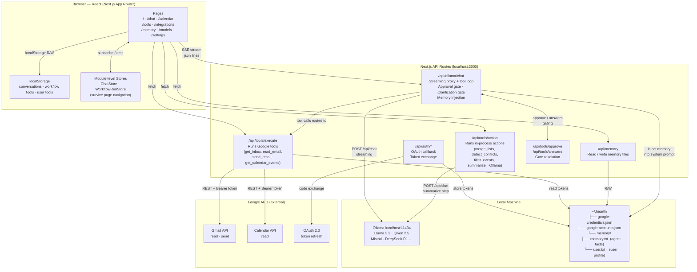

# Hearth — System Design

## Architecture Diagram



## Key Design Principles

| Principle | How |
|---|---|
| **100% local** | Ollama runs on-device; no cloud LLM |
| **Background execution** | `ChatStore` + `WorkflowRunStore` survive React unmount; streams/steps write directly to localStorage |
| **Tool loop** | `/api/ollama/chat` drives a server-side loop: stream → detect tool call → execute → inject result → continue |
| **Approval gate** | Destructive tools (`send_email`, `create_workflow`) pause the stream and require user confirmation via `/api/tools/approve` |
| **UI schema** | LLM produces typed JSON (`card_page` / `list_page` / `text_page`); renderer is deterministic — no free-form markdown for structured data |
| **Multi-account** | All Google calls resolve accounts from `~/.hearth/google-accounts.json`; tokens auto-refresh |
| **Memory** | Agent reads `memory.txt` + `user.txt` from disk via system prompt injection; writes via `memory` tool |

## Data Flow — Chat Message

```
User types message
  → ChatInterface (browser)
  → POST /api/ollama/chat (SSE stream)
      → inject memory + system prompt
      → POST Ollama /api/chat (streaming)
      → detect tool_calls in response
          → if approval needed: emit pending_approval, wait for POST /api/tools/approve
          → execute tool via /api/tools/execute (Google API) or /api/tools/action (in-process)
          → inject tool result, continue stream
      → stream json lines to browser
  → ChatStore mirrors state (survives navigation)
  → persistStreamingContent() writes to localStorage on every token
```

## Data Flow — Workflow Execution

```
User clicks Run on a workflow tool
  → WorkflowRunPage reads tool definition from localStorage
  → WorkflowRunStore.startRun() — fire-and-forget (survives navigation)
  → executeWorkflow() iterates steps:
      → type=tool  → POST /api/tools/execute → Google API
      → type=action → POST /api/tools/action
          → summarize step → POST Ollama /api/chat → UIPage JSON
          → other actions (merge_lists, detect_conflicts, filter_events) → in-process
  → results stored in step context
  → addWorkflowRun() persists to localStorage
  → WorkflowRunStore.finishRun() → sidebar indicator clears
```

## File System Layout

```
~/.hearth/
├── google-credentials.json   OAuth client ID + secret (mode 0600)
├── google-accounts.json      Per-account tokens + nicknames (mode 0600)
└── memory/
    ├── memory.txt            Agent facts (conventions, environment)
    └── user.txt              User profile (preferences, context)

localStorage (browser)
├── hearth_conversations      Chat history
├── hearth_workflow_tools     Workflow tool definitions + run history
├── hearth_user_tools         Simple (non-workflow) tool definitions
├── hearth_default_model      Selected Ollama model name
└── hearth_settings           App settings (memory threshold, etc.)
```
