# Hearth — System Design

## Architecture Diagram

```mermaid
graph TB
    subgraph Browser["Browser — React (Next.js App Router)"]
        direction TB
        Pages["Pages\n/ · /chat · /calendar\n/tools · /integrations\n/memory · /models · /settings"]
        LS["localStorage\nconversations (cap 50) · workflow tools · user tools"]
        GS["Module-level Stores\nChatStore · WorkflowRunStore\n(survive page navigation)"]
    end

    subgraph Server["Next.js API Routes (localhost:3000)"]
        direction TB
        ChatRoute["/api/chat\nStreaming proxy + tool loop\nApproval gate · Clarification gate\nMemory injection · tool_history emit"]
        ToolExec["/api/tools/execute\nRuns all tools\n(Google, Plaid, messaging platforms)"]
        ActionExec["/api/tools/action\nRuns in-process actions\n(merge_lists, detect_conflicts,\nfilter_events, summarize→Ollama)"]
        AuthRoutes["/api/auth/*\nOAuth callback\nToken exchange"]
        MemRoute["/api/memory\nRead / write memory files"]
        ApproveRoutes["/api/tools/approve\n/api/tools/answers\nGate resolution"]
        MsgRoutes["/api/platforms/*\nAdapter-based: connect/disconnect\nstatus · messages/send"]
        ConnRoutes["/api/connections/*\nCustom HTTP connections\nsetup · verify · answer"]
    end

    subgraph LocalMachine["Local Machine"]
        Ollama["Ollama  localhost:11434\nLlama 3.2 · Qwen 2.5\nMistral · DeepSeek R1 …"]
        FS["~/.hearth/\n├── google-credentials.json\n├── google-accounts.json\n├── plaid-credentials.json\n├── plaid-items.json\n├── telegram-config.json\n├── discord-config.json\n├── slack-config.json\n├── matrix-config.json\n├── email-config.json\n├── mattermost-config.json\n├── custom-connections.json\n├── *-messages.jsonl\n└── memory/\n    ├── memory.txt\n    └── user.txt"]
        Adapters["Platform Adapters (ModelAdapter)\nOllama · OpenAI-compat\nUnified chat() + streamChat()"]
        Bots["Bot Singletons (global.*)\nTelegram · Discord · Slack\nMatrix · Mattermost · Email\nWeChat · QQ"]
    end

    subgraph ExternalAPIs["External APIs"]
        Gmail["Gmail API\nread · send"]
        GCal["Calendar API\nread"]
        OAuth["OAuth 2.0\ntoken refresh"]
        Plaid["Plaid API\ntransactions"]
        MsgNets["Messaging Networks\nTelegram · Discord · Slack\nMatrix · Mattermost\nWeChat · QQ"]
        CustomAPIs["Custom HTTP APIs\n(user-registered connections)"]
    end

    %% Browser ↔ Server
    Pages -->|"NDJSON stream"| ChatRoute
    Pages -->|"fetch"| ToolExec
    Pages -->|"fetch"| ActionExec
    Pages -->|"fetch"| MemRoute
    Pages -->|"fetch"| MsgRoutes
    Pages -->|"fetch"| ConnRoutes
    Pages -->|"localStorage R/W"| LS
    Pages <-->|"subscribe / emit"| GS

    %% Server ↔ Ollama
    ChatRoute -->|"POST /api/chat streaming"| Ollama
    ActionExec -->|"POST /api/chat summarize step"| Ollama

    %% Server ↔ External
    ToolExec -->|"REST + Bearer token"| Gmail
    ToolExec -->|"REST + Bearer token"| GCal
    AuthRoutes -->|"code exchange"| OAuth
    ToolExec -->|"REST"| Plaid
    ToolExec -->|"http_request + stored creds"| CustomAPIs
    ChatRoute -->|"tool calls routed to"| ToolExec

    %% Server ↔ FS
    AuthRoutes -->|"store tokens"| FS
    ToolExec -->|"read tokens"| FS
    MemRoute -->|"R/W"| FS
    ChatRoute -->|"inject memory into system prompt"| FS
    MsgRoutes <-->|"R/W state + messages"| FS
    ConnRoutes -->|"R/W credentials"| FS

    %% Adapters
    ChatRoute -->|"getModelAdapter()"| Adapters
    Adapters -->|"forward"| Ollama

    %% Bot singletons ↔ networks
    Bots -->|"platform protocols"| MsgNets
    MsgRoutes <-->|"start/stop/query"| Bots

    %% Tool loop
    ChatRoute <-->|"approve / answers gating"| ApproveRoutes
```



## Three-Layer Architecture (Butler / Monkey / Connector)

The system is evolving toward a strict 3-layer separation:

```
🗣️  MONKEY LAYER  — Channel Agents
    WeChat · QQ · Telegram · Discord · Slack · Matrix · Mattermost · Email
    Input adapter + Output adapter only — no decision-making, no tool calls

        ↓ forward message / ↑ reply result

🧠  BUTLER LAYER  — Unified Brain
    TaskBuilder → Planner → ExecutionPolicy → Executor
    Single decision point: intent classification, privacy tagging, policy enforcement

        ↓ call connector / ↑ data

🔧  CONNECTOR LAYER  — Tools & Data Sources
    Gmail · Calendar · Plaid · Memory · Message Stores · Custom HTTP Connections
    No personality, no dialogue — called only by Executor
```

### Butler Pipeline (Step 1 — implemented)

Every tool call in `/api/chat` now flows through:

```
Ollama tool_call
  → buildTask(toolName, args)          task-builder.ts  — intent + privacyLevel + canUseCloud
  → executeTask(task, ctx)             executor.ts      — enforces policy, handles approval
      → enforcePolicy(task)            policy.ts        — allow | confirm | block
      → ctx.requireApproval(task)      (NDJSON callback)— emits pending_approval, waits
      → executeTool(task.toolName, …)  tools.ts         — unchanged dispatch
      → ctx.logEvent(task, result)
```

**Privacy levels** (tagged on every Task — used for future cloud routing):
- `high`: Gmail content, Plaid transactions, all messaging reads/sends — never leave device
- `medium`: Calendar events
- `low`: `query_events`, `memory`, `ask_clarification` — safe to send to cloud model

**Step 2 (planned):** `src/lib/butler/monkey-registry.ts` — unify bot singletons into Monkey objects with session routing (same user across platforms → same Butler session)

**Step 3 (planned):** `src/lib/butler/cloud.ts` — cloud model routing gated by `task.canUseCloud`; cloud receives only abstract intent descriptions, never real data

---

## Context Management

Three tiers of memory with different lifetimes and cleanup policies:

```
┌────────────────┬──────────────────────────────────────────────────────────┐
│ Within turn    │ loopMessages (server RAM only, discarded after response) │
│ Within session │ hidden messages in localStorage (pruned to last 10 sent) │
│ 7-day window   │ stale conversation hidden messages stripped on load/save  │
│ Cross-session  │ memory.txt / user.txt — distilled facts, not raw output  │
└────────────────┴──────────────────────────────────────────────────────────┘
```

### Tool History (within-session continuity)

After each tool-calling turn, the server emits a `tool_history` NDJSON event before the final streamed text. The client inserts these as `hidden: true` messages into the conversation, positioned between the user message and the final assistant reply:

```
convo.messages = [
  { role: 'user',      hidden: false }   ← visible
  { role: 'assistant', hidden: true,  tool_calls: [...] }   ← sent to model
  { role: 'tool',      hidden: true,  content: '...' }      ← sent to model
  { role: 'assistant', hidden: false, content: 'final' }    ← visible
]
```

Tool result content is trimmed to 2000 chars server-side before emit. On subsequent turns, hidden messages are included in `ollamaMessages` — but only the **most recent 10** when more than 20 have accumulated (preserving assistant+tool pairs to avoid orphaned tool results).

### localStorage Cleanup (on every load and save)

```
cleanConversations()
  1. slice(0, 50)                     — cap total conversations
  2. strip hidden msgs where           — 7-day stale cleanup
     updatedAt < now - 7d              (raw traces no longer needed;
                                        conclusions should be in memory.txt)

safeSetItem()
  → QuotaExceededError?
      drop oldest half, retry once
      still fails? log warn, continue silently
```

Cleanup is applied in `loadConversations` (with immediate write-back) and `saveConversations`. Hot-path writes (`persistStreamingContent`, inline tool_history write) use `safeSetItem` only — no cleanup pass.

### Cross-Session Memory

The system prompt instructs the model to save tool/research findings to `memory.txt` immediately after each tool-calling turn, in the format `<Service>: <finding>` (e.g. `"Tapo API: only Google Home integration available — no direct REST API"`). These persist in `~/.hearth/memory/memory.txt` (AES-256-GCM encrypted) and are injected into every subsequent session's system prompt, trimmed to fit within 20% of the model's context window.

---

## Key Design Principles

| Principle | How |
|---|---|
| **100% local** | Ollama runs on-device; no cloud LLM |
| **Background execution** | `ChatStore` + `WorkflowRunStore` survive React unmount; streams/steps write directly to localStorage |
| **Tool loop** | `/api/chat` drives a server-side loop (max 5 iterations): stream → detect tool call → execute → inject result → continue |
| **Tool history persistence** | After each tool turn, `tool_history` event emitted; client stores hidden messages for within-session consistency |
| **Approval gate** | Destructive tools (`send_email`, `send_*_message`, `create_workflow`) pause the stream and require user confirmation via `/api/tools/approve` |
| **Context pruning** | Hidden tool messages capped at last 10 in outgoing requests; stale ones stripped after 7 days; localStorage capped at 50 conversations |
| **Cross-session memory** | Model writes distilled research findings to `memory.txt` via `memory` tool; injected into every session's system prompt |
| **Adapter pattern** | `ModelAdapter` interface decouples the tool loop from Ollama/OpenAI specifics; `getModelAdapter()` selects at runtime |
| **Bot singletons** | Each messaging platform runs as a long-lived Node.js singleton that survives Next.js hot reloads and auto-restarts on server boot if credentials exist |
| **Encrypted storage** | All credentials and per-line message logs use AES-256-GCM via `secure-storage.ts`; key lives in OS keychain (keytar) with a file fallback |
| **Custom connections** | LLM can discover + register arbitrary HTTP APIs via `ask_clarification` → `web_search` → `request_connection` → `create_workflow`; credentials stored in `custom-connections.json` |
| **Multi-account** | All Google calls resolve accounts from `~/.hearth/google-accounts.json`; tokens auto-refresh |

## Integrations

| Platform | Package | Auth | Notes |
|---|---|---|---|
| Gmail | Google API | OAuth 2.0 | Multi-account; read + send |
| Google Calendar | Google API | OAuth 2.0 | Multi-account; read |
| Plaid | plaid | Client ID + secret | Bank transactions |
| WeChat | wechaty + wechaty-puppet-wechat4u | QR code scan | Web protocol; blocked for accounts created after ~2017 |
| QQ | icqq | QR code scan | Session persists across restarts |
| Telegram | telegraf | Bot token (@BotFather) | Bot receives messages sent to it |
| Discord | discord.js | Bot token (developer portal) | Requires Message Content Intent; reads guild channels |
| Slack | @slack/bolt | Bot token + App token | Socket Mode; reads channels bot is invited to |
| Matrix | matrix-js-sdk | Access token + homeserver | Joins rooms; supports self-hosted servers |
| Email (IMAP/SMTP) | imapflow + nodemailer | Username + password / app password | Read inbox + send; works with Gmail, Outlook, etc. |
| Mattermost | @mattermost/client | Bot token + server URL | Self-hosted or cloud; reads team channels |
| Custom HTTP | built-in http_request | Per-connection credentials | LLM-registered; any REST API with stored credentials |

## Data Flow — Chat Message

```
User types message
  → ChatInterface (browser)
      → filter hidden msgs: keep all if ≤20, keep last 10 if >20
      → POST /api/chat {model, messages: [visible + pruned hidden]}

  → /api/chat (server)
      → inject memory.txt + user.txt into system prompt (trimmed to 20% ctx)
      → loopMessages = [system, ...client_messages]
      → for i in 0..MAX_TOOL_ITERATIONS:
          → adapter.chat(loopMessages, tools)   ← non-streaming, detects tool calls
          → if tool_calls:
              → push assistant+tool_calls to loopMessages
              → executeTask() via Butler pipeline (policy check → approval gate → execute)
              → model calls memory tool → writes conclusion to memory.txt
              → push tool results to loopMessages
          → else:
              → emitToolHistory()   → { tool_history: [...trimmed to 2000 chars] }
              → streamFinal()       → { message: {content}, done } chunks
              → break
      → writer.close()

  → ChatInterface stream reader
      → tool_history event:
          → build hidden Message[] (hidden: true)
          → write to localStorage synchronously (before persistStreamingContent runs)
          → setConversations() to update React state
      → message event:
          → accumulate text
          → persistStreamingContent() → safeSetItem() to localStorage
          → setConversations() for UI update

  → ChatStore mirrors streaming state (survives navigation)
  → cleanConversations() applied on next save (cap 50, strip stale hidden)
```

## Data Flow — Messaging Bot

```
instrumentation.ts (server boot)
  → if session/token file exists: startBot() for each platform via adapter

Platform Adapter (long-lived Node.js singleton)
  → on message: appendMessage() → ~/.hearth/{platform}-messages.jsonl (encrypted per-line)
  → on login/error: update state object in global.__*

AI tool call (get_*_messages / send_*_message)
  → reads from store (queryMessages) or calls adapter.send()
  → send_* requires user approval before executing
```

## Data Flow — Workflow Execution

```
User clicks Run on a workflow tool
  → WorkflowRunPage reads tool definition from localStorage
  → WorkflowRunStore.startRun() — fire-and-forget (survives navigation)
  → executeWorkflow() iterates steps:
      → type=tool  → POST /api/tools/execute → external API
      → type=action → POST /api/tools/action
          → summarize step → POST Ollama /api/chat → UIPage JSON
          → other actions (merge_lists, detect_conflicts, filter_events) → in-process
  → results stored in step context
  → addWorkflowRun() persists to localStorage
  → WorkflowRunStore.finishRun() → sidebar indicator clears
```

## Data Flow — Custom Connection Setup (LLM-guided)

```
User: "I want to connect to Tapo"
  → LLM calls ask_clarification (confirm intent)
  → LLM calls web_search (find API docs + required credentials)
  → LLM calls request_connection {service, credentials[], testUrl}
      → client shows ConnectionSetupCard UI
      → user fills credentials → POST /api/connections/setup
          → verifies testUrl with injected auth header
          → stores in ~/.hearth/custom-connections.json (encrypted)
      → resolves to connection ID
  → LLM calls create_workflow using http_request steps with connection: "<service>"
```

## File System Layout

```
~/.hearth/
├── google-credentials.json      OAuth client ID + secret (mode 0600)
├── google-accounts.json         Per-account tokens + nicknames (mode 0600)
├── plaid-credentials.json       Plaid client ID + secret (mode 0600)
├── plaid-items.json             Linked bank items + access tokens (mode 0600)
├── telegram-config.json         Telegram bot token (mode 0600)
├── discord-config.json          Discord bot token (mode 0600)
├── slack-config.json            Slack bot + app tokens (mode 0600)
├── matrix-config.json           Matrix access token + homeserver (mode 0600)
├── email-config.json            IMAP/SMTP credentials (mode 0600)
├── mattermost-config.json       Mattermost bot token + server URL (mode 0600)
├── custom-connections.json      LLM-registered HTTP connections + credentials (mode 0600)
├── wechat-session/              Wechaty session cache
├── qq-session/                  icqq session cache
├── wechat-messages.jsonl        Encrypted per-line message log
├── qq-messages.jsonl            Encrypted per-line message log
├── telegram-messages.jsonl      Encrypted per-line message log
├── discord-messages.jsonl       Encrypted per-line message log
├── slack-messages.jsonl         Encrypted per-line message log
├── matrix-messages.jsonl        Encrypted per-line message log
└── memory/
    ├── memory.txt               Agent facts — conventions, research findings, environment
    └── user.txt                 User profile — preferences, communication style

localStorage (browser)
├── hearth_conversations         Chat history (cap: 50; stale hidden stripped after 7d)
├── hearth_workflow_tools        Workflow tool definitions + run history
├── hearth_user_tools            Simple (non-workflow) tool definitions
├── hearth_default_model         Selected Ollama model name
└── hearth_settings              App settings (memory threshold, theme, etc.)
```
