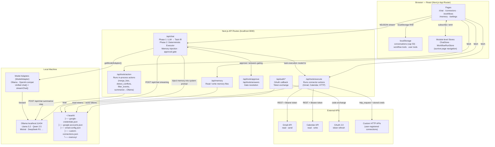

# Hearth — System Design

## v1 Goal

Hearth v1 = a local AI OS where the user can: connect core tools + run workflows + controlled execution + clearly see what AI is doing.

**v1 Success Criteria:**
1. Open app
2. Say one thing
3. Click one connect
4. Watch execution
5. Get result

---

## Architecture Diagram



---

## Three-Layer Architecture

```
🖥️  UI LAYER
    /chat · /connectors · /workflows · /memory · /settings
    Input · Execution Timeline · Connector setup · Workflow management

        ↓ user input / ↑ stream result

🧠  BUTLER LAYER  — Unified Brain
    Intent → LLM (plan only) → Task IR → Validator → Executor
    Single decision point: planning, validation, policy enforcement

        ↓ call connector / ↑ data

🔧  CONNECTOR LAYER  — Tools & Data Sources
    Gmail · Calendar · Email · Memory · HTTP · System
    No personality, no dialogue — called only by Executor
```

---

## Core: Task IR

Task IR (Intermediate Representation) is the system's central constraint layer. **The LLM only generates Task IR — it executes nothing.** The Executor validates the Task IR, then executes deterministically.

This is the only hard constraint preventing the system from degrading into a fuzzy agent.

### Task Schema

```typescript
type Task = {
  id: string
  type: "tool" | "action"      // tool = external API, action = local compute
  tool: string                  // connector name, e.g. "gmail" | "system"
  action: string                // action name, e.g. "get_inbox" | "merge_lists"
  args: Record<string, any>
  depends_on?: string[]         // task ids that must complete first
  safety_level: "low" | "medium" | "high"
  retry_policy?: "none" | "simple"
}

type TaskPlan = {
  tasks: Task[]
  trigger: "user_prompt" | "schedule" | "connector_event"
}
```

### Three Key Fields

| Field | Problem it solves |
|---|---|
| `safety_level` | Approval gate no longer hardcodes toolName — driven uniformly by this field |
| `depends_on` | Executor auto-sorts; LLM generation order doesn't matter |
| `type` | Executor routes: `tool` → `/api/tools/execute`, `action` → `/api/tools/action` |

### Validator Rules

1. All `args` must conform to the connector action's `input_schema`
2. `depends_on` task IDs must exist within the same plan
3. Dependency graph must be acyclic
4. `tool` + `action` combination must exist in the registered connector registry
5. Invalid → reject entire plan, return error to user

### Safety Level → Approval Gate

```
high   → must get user confirm  (send_email, http POST/DELETE)
medium → show to user, auto-execute  (calendar write)
low    → silent execution  (get_inbox, memory read, summarize)
```

---

## Butler Pipeline

### Two-Phase Execution

The old problem: LLM directly called tools inside the loop — LLM was actually controlling execution.

Changed to two phases:

**Phase 1: Planning (LLM participates)**
```
User input
  → load memory
  → LLM generates complete TaskPlan (one shot)
  → Validator: schema + deps + connector registry check
  → if invalid: retry LLM (max 2x), then return error to user
  → if valid: proceed to Phase 2
```

**Phase 2: Execution (Deterministic — no LLM)**
```
TaskPlan
  → topological sort by depends_on
  → for each task:
      → enforcePolicy(task.safety_level)
      → if high: emit pending_approval, wait for user
      → execute: type=tool   → /api/tools/execute
                 type=action → /api/tools/action
      → store result in task context
      → emit execution_step event to UI
  → streamFinal() with all results
  → flushMemoryQueue()
```

**Result: LLM is the advisor. You are the executor.**

---

## Connector Layer

### Connector Schema

```typescript
type ConnectorAction = {
  name: string
  input_schema: Record<string, any>   // used by Validator
  output_schema: Record<string, any>  // used by downstream tasks
  safety_level: "low" | "medium" | "high"
}

type Connector = {
  name: string
  auth: "oauth" | "api_key" | "none"
  allowed_domains?: string[]          // HTTP allowlist
  actions: ConnectorAction[]
}
```

### v1 Connectors

```
connectors = [
  {
    name: "gmail",
    auth: "oauth",
    allowed_domains: ["gmail.googleapis.com"],
    actions: [
      { name: "get_inbox",   safety_level: "low",  ... },
      { name: "send_email",  safety_level: "high", ... }
    ]
  },
  {
    name: "calendar",
    auth: "oauth",
    allowed_domains: ["www.googleapis.com"],
    actions: [
      { name: "get_events",    safety_level: "low",    ... },
      { name: "create_event",  safety_level: "medium", ... }
    ]
  },
  {
    name: "email",
    auth: "api_key",
    actions: [
      { name: "get_inbox",   safety_level: "low",  ... },
      { name: "send_email",  safety_level: "high", ... }
    ]
  },
  {
    name: "memory",
    auth: "none",
    actions: [
      { name: "add",    safety_level: "low", ... },
      { name: "search", safety_level: "low", ... },
      { name: "remove", safety_level: "low", ... }
    ]
  },
  {
    name: "http",
    auth: "api_key",
    actions: [
      { name: "get",    safety_level: "low",  ... },
      { name: "post",   safety_level: "high", ... },
      { name: "delete", safety_level: "high", ... }
    ]
  },
  {
    name: "system",   // local compute, in-process
    auth: "none",
    actions: [
      { name: "merge_lists",      safety_level: "low", ... },
      { name: "detect_conflicts", safety_level: "low", ... },
      { name: "filter_events",    safety_level: "low", ... },
      { name: "summarize",        safety_level: "low", ... }
    ]
  }
]
```

---

## Workflow

Workflows are stored directly as Task IR and share the same executor as chat. No two separate systems.

```typescript
type Workflow = {
  id: string
  name: string                    // e.g. "Morning Routine"
  trigger: TaskPlan["trigger"]
  tasks: Task[]                   // directly Task IR
  createdAt: string
  runs: WorkflowRun[]
}
```

**Benefits:**
- Workflow and chat run through the same executor
- Workflows automatically get the approval gate (`safety_level`)
- Workflows can be generated directly from chat (AI generates TaskPlan → saved to WorkflowStore)
- Dependencies expressed via `depends_on`, more reliable than array order

---

## Trigger Model

Three triggers defined upfront — otherwise morning automation will require a full rewrite:

```
user_prompt      → user types in /chat
schedule         → cron expression, fires workflow on schedule
connector_event  → reserved for future use (e.g. new email arrives triggers workflow)
```

v1 implements: `user_prompt` + `schedule`. `connector_event` interface reserved.

---

## Context Management

Three tiers of memory with different lifetimes:

```
┌────────────────┬──────────────────────────────────────────────────────────┐
│ Within turn    │ task context (server RAM only, discarded after response) │
│ Within session │ hidden messages in localStorage (pruned to last 10)      │
│ 7-day window   │ stale conversation hidden messages stripped on load/save  │
│ Cross-session  │ memory.txt / user.txt — distilled facts, not raw output  │
└────────────────┴──────────────────────────────────────────────────────────┘
```

### Tool History (within-session continuity)

After each task executes, the server emits an `execution_step` event; the client stores it as a `hidden: true` message:

```
convo.messages = [
  { role: 'user',      hidden: false }
  { role: 'assistant', hidden: true,  tool_calls: [...] }   ← sent to model
  { role: 'tool',      hidden: true,  content: '...' }      ← sent to model
  { role: 'assistant', hidden: false, content: 'final' }    ← visible
]
```

Hidden messages capped at last 10 when more than 20 accumulate. Tool result content trimmed to 2000 chars server-side.

### localStorage Cleanup

```
cleanConversations()
  1. slice(0, 50)                     — cap total conversations
  2. strip hidden msgs where           — 7-day stale cleanup
     updatedAt < now - 7d

safeSetItem()
  → QuotaExceededError?
      drop oldest half, retry once
      still fails? log warn, continue silently
```

### Cross-Session Memory

```
~/.hearth/memory/
├── hearth.md        Static instructions — always injected in full (≤2000 chars)
├── user.txt         User profile facts (encrypted) — always injected, LIFO-trimmed
├── memory.txt       Learned facts (encrypted) — top-5 semantic retrieval per query
└── embeddings.json  SHA-256(entry) → float[] cache
```

**System prompt construction:**
```
system = SYSTEM_MESSAGE
       + <hearth>hearth.md</hearth>
       + <user_profile>user.txt</user_profile>
       + <memory>top-5 relevant entries</memory>
```

**Write pipeline:**
```
memory.add(content)
  → validateMemoryEntry()   empty / multi-line / >280 chars / action not fact /
                             transient time refs / JSON / long numerics
  → if invalid: return "Rejected: <reason>"
  → queueMemoryWrite() → 5s debounce

request finally block:
  → flushMemoryQueue()
      add:     isSemanticDuplicate() → replaceEntry() or addEntry()
      replace: replaceEntry() directly
      remove:  removeEntry() directly
```

**Semantic retrieval:**
1. Embed last user message via `POST /api/embeddings` (5s timeout)
2. If Ollama unavailable: LIFO fallback
3. Cosine similarity, filter > 0.3, take top-5
4. Dedup threshold: 0.85 (replace rather than append)

---

## UI Components

### Execution Timeline (critical to UX)

```
[1] Getting emails...         ✅
[2] Filtering important...    ✅
[3] Summarizing...            ⏳
[4] Send summary              ⏸  (waiting for approval)
```

Each step shows: connector name · action · args summary · status · result summary.

### Connector Page

```
[Gmail]       Connected ✅
[Calendar]    Connect →
[Email]       Connect →
[Custom API]  Add →
```

**User flow:**
```
User: check my email
  ↓
AI: needs gmail connector (task validation finds gmail connector unauthorized)
  ↓
UI: Connect Gmail button
  ↓
OAuth
  ↓
success → auto-resumes execution
```

---

## Data Flow — Chat Message

```
User types message
  → ChatInterface (browser)
      → filter hidden msgs: keep all if ≤20, keep last 10 if >20
      → POST /api/chat {model, messages: [visible + pruned hidden]}

  → /api/chat — Phase 1: Planning
      → load hearth.md + user.txt (LIFO) + top-5 memory.txt (semantic)
      → LLM generates TaskPlan (one shot)
      → Validator: schema + deps + connector registry check
      → if invalid: retry LLM (max 2x), then return error to user

  → /api/chat — Phase 2: Execution
      → topological sort tasks by depends_on
      → for each task:
          → enforcePolicy(task.safety_level)
          → if high: emit pending_approval → wait /api/tools/approve
          → type=tool   → /api/tools/execute → external API
          → type=action → /api/tools/action  → in-process
          → emit execution_step event to UI
      → emitToolHistory()
      → streamFinal()
      → flushMemoryQueue() — semantic dedup → write memory.txt
      → writer.close()

  → ChatInterface stream reader
      → execution_step events → update Execution Timeline UI
      → tool_history event    → store hidden messages in localStorage
      → message events        → accumulate + persist + update UI

  → cleanConversations() on next save
```

## Data Flow — Workflow Execution

```
User clicks Run (or schedule trigger fires)
  → WorkflowRunStore.startRun()
  → load Workflow.tasks (already Task IR)
  → same Phase 2 executor as chat
      → topological sort
      → policy check → approval gate → execute
      → emit execution_step
  → addWorkflowRun() persists to localStorage
  → WorkflowRunStore.finishRun()
```

---

## Key Design Principles

| Principle | How |
|---|---|
| **LLM as planner only** | LLM generates TaskPlan once; no LLM inside execution loop |
| **Strict Task IR** | All tasks validated against connector schema before execution; invalid plan = rejected |
| **Safety-level driven policy** | `safety_level` on every action drives approval gate; no hardcoded toolName checks |
| **Unified executor** | Chat and workflow both run through same Phase 2 executor |
| **100% local** | Ollama on-device; no cloud LLM |
| **Background execution** | `ChatStore` + `WorkflowRunStore` survive React unmount |
| **Visible execution** | Every task emits `execution_step`; user always sees what AI is doing |
| **Connector OS** | Each connector has strict schema; new connectors get policy/validation automatically |
| **Cross-session memory** | hearth.md (static) + user.txt (always) + memory.txt (top-5 semantic) |
| **Encrypted storage** | Credentials use AES-256-GCM via `secure-storage.ts`; key in OS keychain |
| **Multi-account Google** | All Google calls resolve from `~/.hearth/google-accounts.json`; tokens auto-refresh |
| **Trigger model** | `user_prompt` / `schedule` / `connector_event` defined upfront to avoid future rewrites |

---

## What's Removed in v1

| Removed | Reason |
|---|---|
| Telegram / Discord / Slack / Matrix / Mattermost | Not core to v1 UX; adds 60% complexity for 0% of main flow |
| WeChat / QQ / WhatsApp | Same |
| Plaid | Not needed for v1 |
| Bot singletons (`global.__*`) | Removed with social media bots |
| `*-messages.jsonl` for social platforms | Removed with bots |
| Monkey layer | Removed with social media bots |
| Cloud model routing | No cloud in v1 |
| LLM-inside-executor loop | Replaced by two-phase planning + deterministic execution |

---

## Integrations (v1)

| Platform | Package | Auth | Notes |
|---|---|---|---|
| Gmail | Google API | OAuth 2.0 | Multi-account; read + send |
| Google Calendar | Google API | OAuth 2.0 | Multi-account; read + write |
| Email (IMAP/SMTP) | imapflow + nodemailer | Username + password / app password | Read inbox + send; works with Gmail, Outlook, etc. |
| Custom HTTP | built-in http_request | API key | Any REST API with stored credentials |

---

## File System Layout

```
~/.hearth/
├── google-credentials.json      OAuth client ID + secret (mode 0600)
├── google-accounts.json         Per-account tokens + nicknames (mode 0600)
├── email-config.json            IMAP/SMTP credentials (mode 0600)
├── email-messages.jsonl         Encrypted per-line message log
├── custom-connections.json      User-registered HTTP connections + credentials (mode 0600)
└── memory/
    ├── hearth.md                Static instructions — user-editable, always loaded in full
    ├── memory.txt               Learned facts — retrieved top-5 per query
    ├── user.txt                 User profile — always loaded, LIFO-trimmed to context budget
    └── embeddings.json          SHA-256(entry) → float[] cache for semantic retrieval/dedup

localStorage (browser)
├── hearth_conversations         Chat history (cap: 50; stale hidden stripped after 7d)
├── hearth_workflow_tools        Workflow definitions (Task IR) + run history
├── hearth_user_tools            Simple tool definitions
├── hearth_default_model         Selected Ollama model name
└── hearth_settings              App settings (memory threshold, theme, etc.)
```
