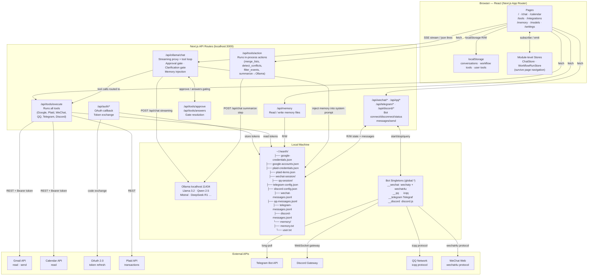

# Hearth — System Design

## Architecture Diagram



## Key Design Principles

| Principle | How |
|---|---|
| **100% local** | Ollama runs on-device; no cloud LLM |
| **Background execution** | `ChatStore` + `WorkflowRunStore` survive React unmount; streams/steps write directly to localStorage |
| **Tool loop** | `/api/ollama/chat` drives a server-side loop: stream → detect tool call → execute → inject result → continue |
| **Approval gate** | Destructive tools (`send_email`, `send_*_message`, `create_workflow`) pause the stream and require user confirmation via `/api/tools/approve` |
| **Bot singletons** | Each messaging platform runs as a long-lived Node.js singleton (`global.__wechat`, `global.__qq`, etc.) that survives Next.js hot reloads and auto-restarts on server boot if credentials exist |
| **Encrypted storage** | All credentials and per-line message logs use AES-256-GCM via `secure-storage.ts`; key lives in OS keychain (keytar) with a file fallback |
| **UI schema** | LLM produces typed JSON (`card_page` / `list_page` / `text_page`); renderer is deterministic — no free-form markdown for structured data |
| **Multi-account** | All Google calls resolve accounts from `~/.hearth/google-accounts.json`; tokens auto-refresh |
| **Memory** | Agent reads `memory.txt` + `user.txt` from disk via system prompt injection; writes via `memory` tool |

## Integrations

| Platform | Package | Auth | Notes |
|---|---|---|---|
| Gmail | Google API | OAuth 2.0 | Multi-account; read + send |
| Google Calendar | Google API | OAuth 2.0 | Multi-account; read |
| Plaid | plaid | Client ID + secret | Bank transactions |
| WeChat | wechaty + wechaty-puppet-wechat4u | QR code scan | Web protocol; blocked for accounts created after ~2017 |
| QQ | icqq | QR code scan | Session persists across restarts |
| Telegram | telegraf | Bot token (@BotFather) | Bot receives messages sent to it |
| Discord | discord.js | Bot token (developer portal) | Requires Message Content Intent; reads guild channels |

## Data Flow — Chat Message

```
User types message
  → ChatInterface (browser)
  → POST /api/ollama/chat (SSE stream)
      → inject memory + system prompt
      → POST Ollama /api/chat (streaming)
      → detect tool_calls in response
          → if approval needed: emit pending_approval, wait for POST /api/tools/approve
          → execute tool via /api/tools/execute or /api/tools/action (in-process)
          → inject tool result, continue stream
      → stream json lines to browser
  → ChatStore mirrors state (survives navigation)
  → persistStreamingContent() writes to localStorage on every token
```

## Data Flow — Messaging Bot

```
instrumentation.ts (server boot)
  → if session/token file exists: startBot() for each platform

Bot singleton (long-lived Node.js process)
  → on message: appendMessage() → ~/.hearth/{platform}-messages.jsonl (encrypted per-line)
  → on login/error: update state object in global.__*

AI tool call (get_*_messages / send_*_message)
  → reads from store (queryMessages) or calls bot.send()
  → send_* requires user approval before executing
```

## Data Flow — Workflow Execution

```
User clicks Run on a workflow tool
  → WorkflowRunPage reads tool definition from localStorage
  → WorkflowRunStore.startRun() — fire-and-forget (survives navigation)
  → executeWorkflow() iterates steps:
      → type=tool  → POST /api/tools/execute → external API
      → type=action → POST /api/tools/action
          → summarize step → POST Ollama /api/chat → UIPage JSON
          → other actions (merge_lists, detect_conflicts, filter_events) → in-process
  → results stored in step context
  → addWorkflowRun() persists to localStorage
  → WorkflowRunStore.finishRun() → sidebar indicator clears
```

## File System Layout

```
~/.hearth/
├── google-credentials.json      OAuth client ID + secret (mode 0600)
├── google-accounts.json         Per-account tokens + nicknames (mode 0600)
├── plaid-credentials.json       Plaid client ID + secret (mode 0600)
├── plaid-items.json             Linked bank items + access tokens (mode 0600)
├── telegram-config.json         Telegram bot token (mode 0600)
├── discord-config.json          Discord bot token (mode 0600)
├── qq-config.json               Saved QQ UIN for session resume (mode 0600)
├── wechat-session/              Wechaty session cache
├── qq-session/                  icqq session cache
├── wechat-messages.jsonl        Encrypted per-line message log
├── qq-messages.jsonl            Encrypted per-line message log
├── telegram-messages.jsonl      Encrypted per-line message log
├── discord-messages.jsonl       Encrypted per-line message log
└── memory/
    ├── memory.txt               Agent facts (conventions, environment)
    └── user.txt                 User profile (preferences, context)

localStorage (browser)
├── hearth_conversations         Chat history
├── hearth_workflow_tools        Workflow tool definitions + run history
├── hearth_user_tools            Simple (non-workflow) tool definitions
├── hearth_default_model         Selected Ollama model name
└── hearth_settings              App settings (memory threshold, etc.)
```
